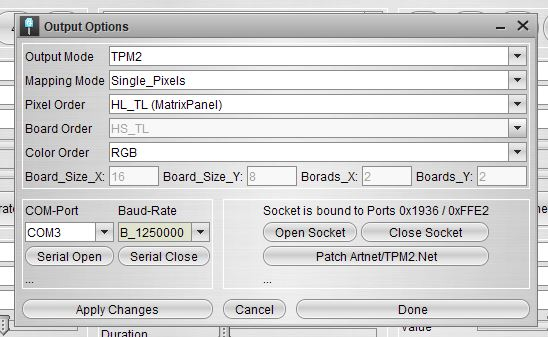
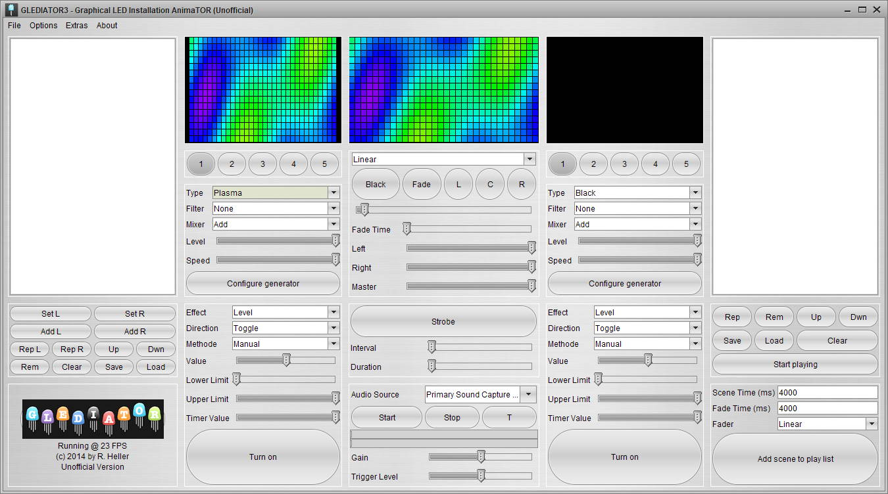

# Glediator3
Unofficial port (reverse engineer) of the Glediator LED Matrix controlling software, with some minor improvements so the Serial Port connection works cross-platform.

 
## How to use

1. Install  the JAVA JRE onto your computer.
2. Execute `java -jar XXXXXXXXXXX.jar` (from the releases directory)
3. Connect to your Matrix_Panel via. Serial Port once having loaded 'Glediator3_TPM2_MatrixPanel' example onto it. Get this from here: https://github.com/mrfaptastic/ESP32-RGB64x32MatrixPanel-I2S-DMA/tree/master/examples/Glediator3_TPM2_MatrixPanel

4. When using this example, ensure to use the correct settings as follows for a 64x32 panel:

## Credits

* R. Heller for creating Glediator

