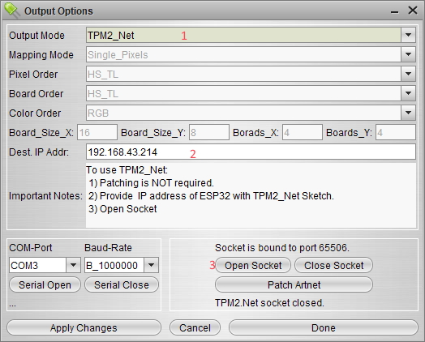

# Glediator3
Unofficial port (reverse engineer) of the Glediator LED Matrix controlling software, with some minor improvements so the Serial Port connection works cross-platform.

 
## How to use

1. Install  the JAVA JRE onto your computer: https://jdk.java.net/14/
2. Execute `java -jar Glediator3-binary-XXXX.jar` (from the releases directory)
3. Connect to your Matrix_Panel via. Serial Port once having loaded 'Glediator3_TPM2_MatrixPanel' example onto it.
OR
Connect to your Matrix_Panel via. WiFi 'Glediator3_TPM2_Net' example onto it. 

4. When using this example, ensure to use the correct settings as follows for a 64x32 panel:

Note: The serial port will differ depending on your computer and what your Arduino / ESP32 is connected to.

5. Then click 'Serial Open' to get things started.

## Credits

* R. Heller for creating Glediator

